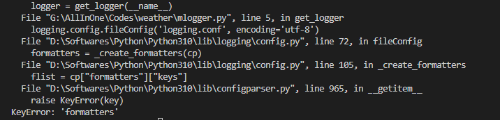
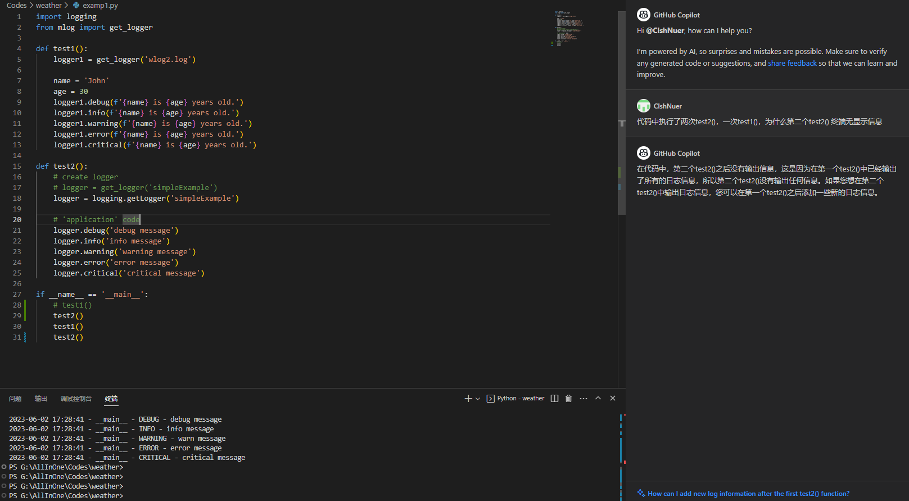

# Python 日志记录器

<!--last modify: 20230618-->

- 强烈安利loguru 第三方库作为项目开发过程中使用的日志记录器


## 0x00 python 标准库模块 warnings

用于控制警告信息的输出

- `warnings.warn(message, category=None, stacklevel=1, source=None)`：发出一条警告信息。
- `warnings.filterwarnings(action, message=None, category=None, module=None, lineno=None, append=False)`：设置警告信息的输出方式。
- `warnings.simplefilter(action, category=Warning, lineno=0, append=False)`：设置简单的警告信息输出方式。
- `warnings.catch_warnings(record=False)`：捕获警告信息并返回一个上下文管理器。

## 0x01 python 标准库 logging

- 参考
  - videos
    - [python 标准库logging](https://www.bilibili.com/video/BV1sK4y1x7e1/?spm_id_from=333.337.search-card.all.click&vd_source=7f220845f0d7bc792a045e75a5ac8b8d)
    - [python 标准库logging](https://www.bilibili.com/video/BV1Qf4y1d7DA/?spm_id_from=333.999.0.0&vd_source=7f220845f0d7bc792a045e75a5ac8b8d)
    - [python 标准库logging](https://www.bilibili.com/video/BV1Ge4y1R7yP/?spm_id_from=333.999.0.0&vd_source=7f220845f0d7bc792a045e75a5ac8b8d)
  - articles
    - [python 标准库logging](https://www.notion.so/logging-3f4c66c25d2747fca94e4badb962d40b?pvs=4)

```plaintext
1. 编程时使用日志
2. logging 格式的配置文件
3. 字典方式配置 logging.config.dictConfig({"loggers":"root, pylog"})
4. print 函数输出不通过logging 模块运行；
```

### 0x01x000 日志级别

| 日志级别     | 数值 | 描述                                                     |
| ------------ | ---- | -------------------------------------------------------- |
| `CRITICAL` | 50   | 严重错误，表示程序无法继续运行。                         |
| `ERROR`    | 40   | 一般错误，表示程序可以继续运行，但是可能会出现问题。     |
| `WARNING`  | 30   | 警告信息，表示程序运行可能会受到影响。                   |
| `INFO`     | 20   | 一般信息，用于记录程序运行的一般信息。                   |
| `DEBUG`    | 10   | 调试信息，用于记录程序运行的详细信息，通常用于调试程序。 |
| `NOTSET`   | 0    | 未设置日志级别，表示使用默认级别。                       |

- 默认输出级别为WARNING

### 0x01x001 日志组件

| 处理器        | 描述                                                             |
| ------------- | ---------------------------------------------------------------- |
| `Logger`    | 日志记录器，用于记录日志信息。                                   |
| `Handler`   | 日志处理器，用于处理日志信息，例如将日志信息输出到文件或控制台。 |
| `Formatter` | 日志格式化器，用于格式化日志信息。                               |
| `Filter`    | 日志过滤器，用于过滤日志信息，例如只记录特定级别的日志信息。     |

- 处理器的方法

| 处理器                       | 描述                                                 |
| ---------------------------- | ---------------------------------------------------- |
| `StreamHandler`            | 将日志信息输出到控制台。                             |
| `FileHandler`              | 将日志信息输出到文件。                               |
| `BaseRotatingFileHandler`  |                                                      |
| `RotatingFileHandler`      | 将日志信息输出到文件，并支持日志文件的自动轮换。     |
| `TimedRotatingFileHandler` | 将日志信息输出到文件，并支持按时间自动轮换日志文件。 |
| `SMTPHandler`              | 将日志信息通过电子邮件发送。                         |
| `SysLogHandler`            | 将日志信息发送到系统日志。                           |
| `NTEventLogHandler`        | 将日志信息发送到 Windows 事件日志。                  |

- 处理流程


- Formatters格式

| 属性        | 格式            | 描述                                                   |
| ----------- | --------------- | ------------------------------------------------------ |
| asctime     | %(asctime)s     | 日志产生的时间，默认格式为msecs 2003-07-0816:49:45,896 |
| msecs       | %(msecs)d       | 日志生成时间的亳秒部分                                 |
| created     | %(created)f     | (time.tme) 生成的日志创建时间戳                        |
| message     | %(message)s     | 具体的日志信息                                         |
| filename    | %(filename)s    | 生成日志的程序名                                       |
| name        | %(name)s        | 日志调用者                                             |
| funcname    | %(funcname)s    | 调用日志的函数名                                       |
| levelname   | %(levelname)s   | 日志级別 (DEBUG, INFO, WARNING, ERROR, CRITICAL)       |
| levene      | %(leveling)s    | 日志级别对应的数值                                     |
| lineno      | %(lineno)d      | 日志所针对的代码行号 (如果可用的话)                    |
| module      | %(module)s      | 生成日志的模块名                                       |
| pathname    | %(pathname)s    | 生成日志的文件的完整路径                               |
| process     | %((process)d    | 生成日志的进程D (如果可用)                             |
| processname | %(processname)s | 进程名 (如果可用)                                      |
| thread      | %(thread)d      | 生成日志的线程D (如果可用)                             |
| threadname  | %(threadname)s  | 线程名 ()如果可用)                                     |

### 0x01x002 关于禁用 paramiko 库的日志记录

paramiko 是一个用于 SSH 连接的 Python 库，可记录各种日志信息，包括调试信息、警告和错误信息。

```python
import logging
import paramiko

# store function we will overwrite to malform the packet
old_parse_service_accept = paramiko.auth_handler.AuthHandler._handler_table[paramiko.common.MSG_SERVICE_ACCEPT]

# assign functions to respective handlers
paramiko.auth_handler.AuthHandler._handler_table[paramiko.common.MSG_SERVICE_ACCEPT] = malform_packet
paramiko.auth_handler.AuthHandler._handler_table[paramiko.common.MSG_USERAUTH_FAILURE] = call_error

# get rid of paramiko logging
logging.getLogger('paramiko.transport').addHandler(logging.NullHandler())
```

logging 模块来禁用 Paramiko 的日志记录，使用 `logging.getLogger()` 函数获取 paramiko.transport 的传输日志记录器，然后使用 `logging.NullHandler()` 函数将其处理程序设置为 `None`，从而禁用日志记录，它不会将日志消息发送到任何处理程序。这个操作可以避免在运行脚本时在控制台上看到 Paramiko 的日志记录信息。

这段代码的目的是为了减少不必要的日志记录，以提高代码的性能和可读性。在某些情况下，日志记录可能会导致性能问题，因为它需要额外的计算和I/O操作。因此，禁用不必要的日志记录可以提高代码的性能。

## 0x02 案例

### 0x02x000 代码形式

```python
import logging

formatter = logging.Formatter('%(asctime)s %(levelname)s %(message)s')

class MyLogger:
    def __init__(self, name, log_file, level=logging.DEBUG):
        self.logger = logging.getLogger(name)
        self.logger.setLevel(level)

        self.file_handler = self._get_file_handler(log_file, level)
        self.stream_handler = self._get_stream_handler(level)

        self.logger.addHandler(self.file_handler)
        self.logger.addHandler(self.stream_handler)

    def _get_file_handler(self, log_file, level=logging.INFO):
        file_handler = logging.FileHandler(log_file)
        file_handler.setFormatter(formatter)
        return file_handler

    def _get_stream_handler(self, level=logging.DEBUG):
        stream_handler = logging.StreamHandler()
        stream_handler.setFormatter(formatter)
        return stream_handler

    def debug(self, msg):
        self.logger.debug(msg)

    def info(self, msg):
        self.logger.info(msg)

    def warning(self, msg):
        self.logger.warning(msg)

    def error(self, msg):
        self.logger.error(msg)

    def critical(self, msg):
        self.logger.critical(msg)

if __name__ == '__main__':
    logger = MyLogger('logger', 'test.log')
    logger._get_file_handler('test.log')
    logger._get_stream_handler()

    logger.debug('This is a debug message')
    logger.info('This is a info message')
    logger.warning('This is a warning message')
    logger.error('This is a error message')
    logger.critical('This is a critical message')
```

以代码形式直接运行

### 0x02x001 配置文件形式

- eg：conf 格式

```python
[loggers]
# 配置logger 信息，必须包含root 的logger；
# 使用无参函数logging.getLogger()时，默认返回root logger；
# 自定义logger 可由logging.getLogger(key_name) 方式调用；
keys=root,file,fileAndConsole

[handlers]
# 定义声明handlers 信息
keys=consoleHandler,fileHandler

[formatters]
# 设置日志格式
keys=simpleFormatter,reverseFormatter

[logger_root]
# 对loggers 中key 逐个对应配置，且所有logger 必须制定lebel 和handlers 两个选项；
# 对于非root handler，需添加额外option，其中qualname 表示在logger 层级中的名字；
# 应用代码中通过此名制定使用的handler，即logging.getLogger("fileAndConsole")；
# handlers 可指定多个，以逗号隔开；
# 如handlers=fileHandler,consoleHandler，同时制定使用控制台和文件输出日志；
level=DEBUG
handlers=consoleHandler,fileHandler

[logger_file]
level=DEBUG
handlers=fileHandler
qualname=file
propagate=1

[logger_fileAndConsole]
level=DEBUG
handlers=fileHandler,consoleHandler
qualname=fileAndConsole
propagate=0

[handler_consoleHandler]
# 在handler 中，必须指定class 和args 两项option；
# 常用class包括 StreamHandler（仅将日志输出到控制台）、FileHandler（将日志信息输出保存到文件）、
# RotaRotatingFileHandler（将日志输出保存到文件中，并设置单个日志文件的大小和日志文件个数）；
# args 表示传递给class 所指定的handler 类初始化方法参数，必须是元组（tuple）形式；
# level 同logger 中level；
# formatter 指定处理器所使用的格式器，格式器名称必须出现在formatters 的section 中；
# 且配置文件必须有formatter 的section定义；不指定formatter 则该handler 以消息本身为日志消息记录；
# 不添加额外时间、日志器名称等信息；
class=StreamHandler
level=DEBUG
formatter=simpleFormatter
args=(sys.stdout,)

[handler_fileHandler]
class=handlers.RotatingFileHandler
level=DEBUG
formatter=simpleFormatter
args=('example.log', 'a', 1024, 3)

[formatter_simpleFormatter]
format=%(asctime)s - %(name)s - %(levelname)s - %(message)s
datefmt=%Y-%m-%d %H:%M:%S
log_colors=
    'DEBUG': 'cyan',
    'INFO': 'green',
    'WARNING': 'yellow',
    'ERROR': 'red',
    'CRITICAL': 'red,bg_white'

# [formatter_reverseFormatter]
# format=%(asctime)s - %(name)s - %(levelname)s - %(message)s
# datefmt=%Y-%m-%d %H:%M:%S2023-06-02 18:22:38,892 DEBUG debug message

```

- eg：yaml 格式

```yaml
version: 1
formatters:
  simple:
    format: '%(asctime)s - %(name)s - %(levelname)s - %(message)s'
handlers:
  console:
    class: logging.StreamHandler
    formatter: simple
    level: DEBUG
    stream: ext://sys.stdout
  file:
    class: logging.FileHandler
    encoding: utf-8
    filename: ./log/example.log
    formatter: simple
    level: DEBUG
    mode: a
loggers:
  example:
    handlers:
    - console
    - file
    level: DEBUG
    propagate: false
root:
  handlers: [console]
  level: INFO

```

### 0x02x002 配置文件使用

```python
import logging.config
import yaml
import colorlog

conf_absolute_path = 'g:/src/config/recorder.conf'
yaml_absolute_path = 'g:/src/config/recorder.yaml'

logging.basicConfig(level=logging.DEBUG)
colorlog.basicConfig(level=logging.DEBUG, format='%(log_color)s%(levelname)s:%(message)s')

# get conf logger
def get_conf_logger(name='__name__', conf_recorder_path=conf_absolute_path):
    logging.config.fileConfig(conf_recorder_path)
    logger = logging.getLogger(name)
    return logger

# get yaml logger
def get_yaml_logger(yaml_recorder_path=yaml_absolute_path):
    with open(yaml_recorder_path, 'r', encoding='utf-8') as f:
        config = yaml.safe_load(f.read())
        logging.config.dictConfig(config)
    logger = logging.getLogger(__name__)
    return logger

# test
def test_logger(logger):
    logger.debug('debug message')
    logger.info('info message')
    logger.warning('warn message')
    logger.error('error message')
    logger.critical('critical message')

if __name__ == '__main__':
    conf_relative_path = '../config/recorder.conf'
    conf_logger = get_conf_logger(__name__, conf_relative_path)
    test_logger(conf_logger)

    # yaml_relative_path = '../config/recorder.yaml'
    # yaml_logger = get_yaml_logger(yaml_relative_path)
    # test_logger(yaml_logger)

```

### 0x02x003 FAQ

- 运行报错



解决方式：检查配置文件及相关程序后发现始终报该错时，注意检查相关文件名是否正确

- 代码中执行了两次test2()，一次test1()，为什么第二个test2() 终端无显示信息



在代码中，第二个test2()之后没有输出信息，这是因为在第一个test2()中已经输出了所有的日志信息，所以第二个test2()没有输出任何信息。如果您想在第二个test2()中输出日志信息，您可以在第一个test2()之后添加一些新的日志信息。

## 0x03 python 第三方库loguru

- 参考
  - videos
    - [python 第三方库loguru](https://www.bilibili.com/video/BV17a411w7Tw/?spm_id_from=333.337.search-card.all.click&vd_source=7f220845f0d7bc792a045e75a5ac8b8d)
    - [python 第三方库loguru](https://www.bilibili.com/video/BV1BQ4y1D7mp/?spm_id_from=333.337.search-card.all.click&vd_source=7f220845f0d7bc792a045e75a5ac8b8d)

### 0x03x000 直接使用

```python
import os
from loguru import logger

logDir = os.path.expanduser('logs')
logFile = os.path.join(logDir, '{time}.log')

if not os.path.exists(logDir):
    os.mkdir(logDir)

logger.info("info")
logger.add(logFile, rotation='200KB', compression='zip', )


try:
    2/0
except:
    logger.exception('error')
```

### 0x03x001 按需优化

```yaml
import sys
import pathlib

from loguru import logger

# 路径设置
relative_directory = pathlib.Path(__file__).parent.parent  # 项目代码相对路径
result_save_dir = relative_directory.joinpath('results')  # 结果保存目录
log_path = result_save_dir.joinpath('automanage.log')  # AutoManage日志保存路径

# 日志配置
# 终端日志输出格式
stdout_fmt = '<cyan>{time:HH:mm:ss,SSS}</cyan> ' \
             '[<level>{level: <5}</level>] ' \
             '<blue>{module}</blue>:<cyan>{line}</cyan> - ' \
             '<level>{message}</level>'
# 日志文件记录格式
logfile_fmt = '<light-green>{time:YYYY-MM-DD HH:mm:ss,SSS}</light-green> ' \
              '[<level>{level: <5}</level>] ' \
              '<cyan>{process.name}({process.id})</cyan>:' \
              '<cyan>{thread.name: <18}({thread.id: <5})</cyan> | ' \
              '<blue>{module}</blue>.<blue>{function}</blue>:' \
              '<blue>{line}</blue> - <level>{message}</level>'

logger.remove()
logger.level(name='TRACE', color='<cyan><bold>')
logger.level(name='DEBUG', color='<blue><bold>')
logger.level(name='INFOR', no=20, color='<green><bold>')
logger.level(name='QUITE', no=25, color='<green><bold>')
logger.level(name='ALERT', no=30, color='<yellow><bold>')
logger.level(name='ERROR', color='<red><bold>')
logger.level(name='FATAL', no=50, color='<RED><bold>')

# 如果你想在命令终端静默运行AutoManage，可以将以下一行中的level设置为QUITE
# 命令终端日志级别默认为INFOR
logger.add(sys.stderr, level='DEBUG', format=stdout_fmt, enqueue=True)
# 日志文件默认为级别为DEBUG
logger.add(log_path, level='DEBUG', format=logfile_fmt, enqueue=True, encoding='utf-8')

```

多线程、异步结构、高并发；

### 0x03x002 关于禁用 paramiko 库的日志记录

```python
import loguru
import paramiko

loguru.logger.disable("paramiko") # 禁用所有日志记录
loguru.logger.disable("paramiko.transport") # 禁用传输级别日志记录
loguru.logger.disable("paramiko.channel") # 禁用通道级别日志记录

# Your code using Paramiko here
```

### 0x03x003 FAQ

- loguru 对具有返回值的函数会自动打印返回值，暂未找到解决方法
- loguru 对具备多线程的函数会部分串行输出，暂未找到解决方法

## 0x04 项目配置文件

```yaml
# 这是一个 YAML 配置文件示例

# 字符串类型
name: "My App"
version: "1.0.0"

# 数字类型
port: 8080

# 布尔类型
debug: true

# 列表类型
features:
  - feature1
  - feature2
  - feature3

# 对象类型
database:
  host: "localhost" # 字符串类型
  port: 3306
  username: "root"
  password: "password"
  database: "my_database"
```
